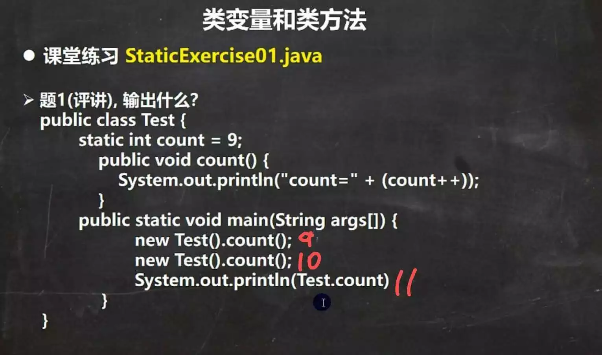
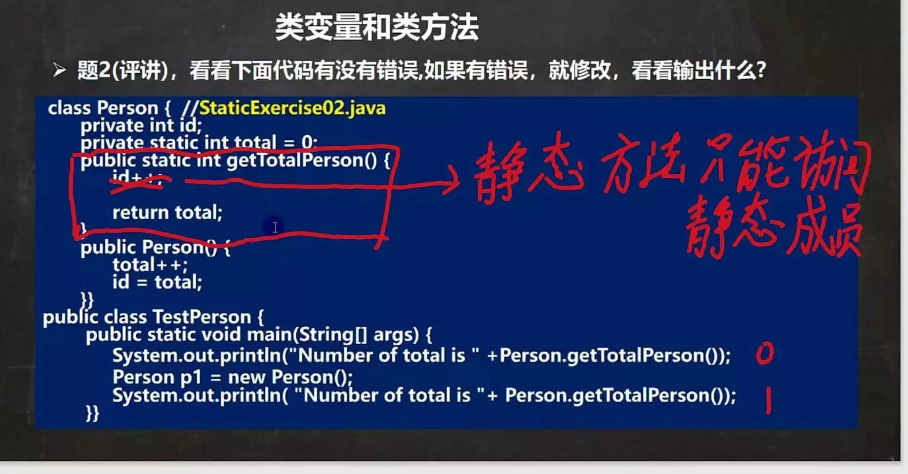
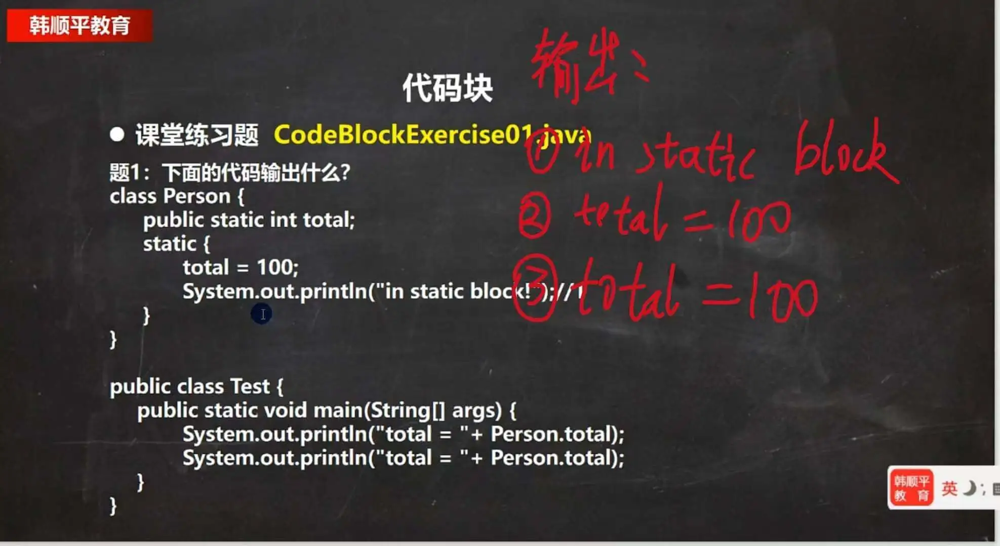
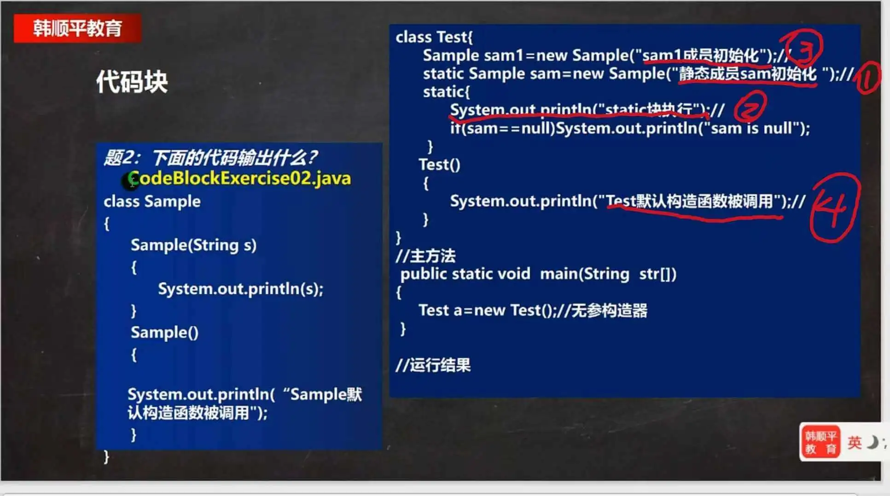

# 3_面向对象编程（高级）

- [3_面向对象编程（高级）](#3_面向对象编程高级)
  - [类变量（静态变量）](#类变量静态变量)
    - [如何定义类变量](#如何定义类变量)
    - [如何使用类变量](#如何使用类变量)
    - [注意事项](#注意事项)
  - [类方法（静态方法）](#类方法静态方法)
    - [类方法的使用场景](#类方法的使用场景)
    - [注意事项](#注意事项-1)
    - [练习：](#练习)
  - [main方法](#main方法)
  - [代码块](#代码块)
    - [基本语法](#基本语法)
    - [注意事项](#注意事项-2)
    - [练习](#练习-1)
  - [单例设计模式](#单例设计模式)
    - [什么是单例模式](#什么是单例模式)
    - [饿汉方式](#饿汉方式)
    - [懒汉方式](#懒汉方式)
  - [final 关键字](#final-关键字)

## 类变量（静态变量）

类变量也叫静态变量/静态属性，是该类的所有对象共享的变量，任何一个该类的对象去访问它时，取到的都是相同的值，同样任何一个该类的对象去修改它时，修改的也是同一个变量。

### 如何定义类变量

访问修饰符 static 数据类型 变量名;

### 如何使用类变量

- 类名称.变量名 【推荐】
- 对象名.变量名 【不推荐】

### 注意事项

- 什么时候需要用类变量
  - 当我们需要让某个类的所有对象都共享一个变量时，就可以考虑使用类变量（静态变量）；
- 类变量与实例变量的区别
  - 类变量是该类的所有对象共享的；
  - 实例变量是每个对象独享的；
- 类变量是在类加载时就初始化了，也就是说，即使没有创建对象，只要类加载了，就可以使用类变量了。
- 类变量的生命周期是随类的加载开始，随类消亡而销毁；

## 类方法（静态方法）

类方法的定义： 访问修饰符 static 返回数据类型 方法名(){ }
类方法的调用： 类名.方法名()

### 类方法的使用场景

- 当方法中不涉及到任何和对象相关的成员，则可以将方法设计成静态方法，提高开发效率。

比如：工具类中的方法 uitls : Math类，Arrays类，Collections集合类 等等；

### 注意事项

- 类方法和普通方法都是随着类的加载而加载，将结构信息存储在方法区：
  - 类方法中无this的参数
  - 普通方法中隐含着this的参数
- 类方法可以通过类名调用，也可以通过对象名调用。
- 类方法中不允许使用和对象有关的关键字，比如`this`和`super`。
- <font color=red>静态方法，只能访问静态的成员；非静态的方法，可以访问静态成员和非静态成员；</font>


### 练习：





## main方法

- 深入理解main方法
  - 解释main方法的形式：public static void main(String[] args){}
    1. Java 虚拟机需要调用类的main()方法，所以该方法的访问权限必须是public；
    2. Java 虚拟机在执行main()方法时不必创建对象，所以该方法是static；
    3. 该方法接收String类型的数组参数，该数组中保存执行java 命令时传递给所运行的类的参数；
    4. java 执行的程序：参数1，参数2，参数3；
  - 由于main()方法是静态方法，，所以可以直接调用类的静态成员；但是，不能直接访问该类的非静态成员，必须创建对象后，才能使用。

## 代码块

<font color=red>代码块又称初始化块，属于类中的成员【即是类的一部分】，类似于方法，将逻辑语句封装在方法体中，通过{}包围起来；

但和方法不同，没有方法名，没有返回，没有参数，只有方法体，而且不用通过对象或类显示调用，而是加载类时，或创建对象时瘾式调用。
</font>

### 基本语法

``` java
[修饰符] {
    代码
};
```

- 注意
  - 修饰符 可选，要写的话，也只能写 static
  - 代码块分为两类，使用static修饰符的叫静态代码块；没有static修饰符的，叫普通代码块。
  - 逻辑语句可以为任何逻辑语句（输入、输出、方法调用、循环、判断等）。
  - 代码块结束的`;`可以写，也可以省略；

- 普通代码块的好处和运用场景
  - 相当于另一种形式的构造器（对构造器的补充机制），可以做初始化的操作；
  - 场景：如果都给构造都有重复的语句，可以抽取到代码块中，提高代码的重用性；
  - <font color=red>普通代码块 调用的顺序优先于构造器 ；</font>

### 注意事项

0. 静态代码块只能直接调用静态成员，普通代码可以调用任意成员；

1. static 代码块也叫静态代码块，作用就是对类进行初始化，而且它随着**类的加载**而执行，并且只会执行一次。如果普通代码块，每创建一个对象，就执行。

2. 类什么时候被加载
   1. 创建对象实例时（new）；
   2. 创建子类对象实例，父类也会被加载；
   3. 使用类的静态成员时；

3. 普通的代码块，在创建对象实例时，会被隐式的调用。被创建一次，就会被调用一次。

4. <font color=red>创建一个对象时，在一个类 调用顺序是：（重点、难点）</font>

   1. 调用静态代码块和静态属性初始化（注意：静态代码块和静态属性初始化调用的优先级一样，如果有多个静态代码块和多个静态变量初始化，则按他们定义的顺序调用）；
   2. 调用普通代码块和普通属性的初始化（注意：普通代码块和普通属性初始化调用的优先级一样，如果有多个普通代码块和多个普通属性初始化，则按定义顺序调用）；
   3. 调用构造方法。
   
5. 构造方法（构造器）的最前面其实隐含了 super()和 调用普通代码块；静态相关的代码块，静态属性初始化，在类加载时，就执行完毕，因此优先于 构造器和普通代码块执行的；

6. <font color=red>创建一个子类时（继承关系），他们的静态代码块，静态属性初始化，普通代码块初始化，构造方法的调用顺序如下：</font>
   1. 父类的静态代码块和静态属性（优先级一样，按定义顺序执行）；
   2. 子类的静态代码块和静态属性（优先级一样，按定义顺序执行）；
   3. 父类的普通代码块和普通属性初始化（优先级一样，按定义顺序执行）；
   4. <font color=red>父类构造器；</font>
   5. 子类的普通代码块和普通属性初始化（优先级一样，按定义顺序执行）；
   6. 子类构造器；

面试题：[查看代码](./code2/src/main/java/org/gx/chapter09/p01/CodeBlockDetail02.java)

### 练习




## 单例设计模式

### 什么是单例模式

- 所谓类的单例设计模式，就是采取一定的方法保证在整个的软件系统中，对某个类只能存在一个对象实例，并且该类只提供一个取得其对象实例的方法；
- 单例模式有两种方式：1）饿汉方式；2）懒汉方式

### 饿汉方式

- 步骤如下：
  - 构造器私有化
  - 类的内部创建对象
  - 向外暴露一个静态的公共方法。getInstance

[查看代码](./code2/src/main/java/org/gx/chapter09/p02/single/HungrySingle.java)

 <font color=red> 注意饿汉方式的缺点：</font>不管是否用到，在类加载时对象就会被创建，导致资源浪费；

### 懒汉方式

- 步骤如下：
  - 构造器私有化
  - 类的内部声明对象，先不要进行实例化；
  - 向外暴露一个静态的公共方法：getInstance()。在该方法中先校验声明的对象有没有被创建，如果没有创建就创建一个；如果已创建，则返回；

[查看代码](./code2/src/main/java/org/gx/chapter09/p02/single/LazySingle.java)

``` java
public class LazySingle {
    private static LazySingle single;
    private LazySingle() {
        System.out.println("LazySingle constructor");
    }
    public static LazySingle getInstance() {
        if (null == single) {
            // 线程不安全，有可能在对象创建之前，getInstance被再次调用，从而再次创建对象，导致单例被破坏；
            single = new LazySingle();
        }
        return single;
    }
}
```

- 优点：懒汉方式 **是在使用时才创建对象**。

- <font color=red> 注意懒汉方式的缺点：</font>；线程安全问题；

## final 关键字

- final 中文意思是：最终的，最后的。
- final 可以修饰类、属性、方法和局部变量。

- final的使用 ：
  - final修饰的类，不能被继承；
  - final修饰的方法，不能被重写；
  - final修饰的属性 和 局部变量，不能被修改；

- 注意事项：
  - final修饰的属性又叫常量，一般用 XX_XX_XX 命名；
  - final修饰的属性在定义时，必须赋初值，并且以后不能再修改，赋值可以在如下位置之一：[查看代码](./code2/src/main/java/org/gx/chapter09/p03/final_/FinalDetail01.java)
    - 定义时；如：public final double TAX_RATE = 0.08;
    - 在构造器中；
    - 在代码块中；
  - 如果final修饰的属性是静态的，则初始化的位置只能是：1）定义时；2）在静态代码块。不能在构造器中赋值。[查看代码](./code2/src/main/java/org/gx/chapter09/p03/final_/FinalDetail02.java)
  - final类不能继承，但是可以实例化对象；
  - 如果类不是final类，但是含有final方法，则该方法虽然不能被重写，但是可以被继承。[查看代码](./code2/src/main/java/org/gx/chapter09/p03/final_/FinalDetail03.java)
  - 一般来说，如果一个类已经是final类类，就没有必要再将方法修饰成final方法。
  - final不能修饰构造器方法。
  - final和static往往搭配使用，效率更高，底层编译做了优化处理。
  - 包装类（Integer，Double，Float，Boolean，Long 等等）都是final类，String 也是final类。