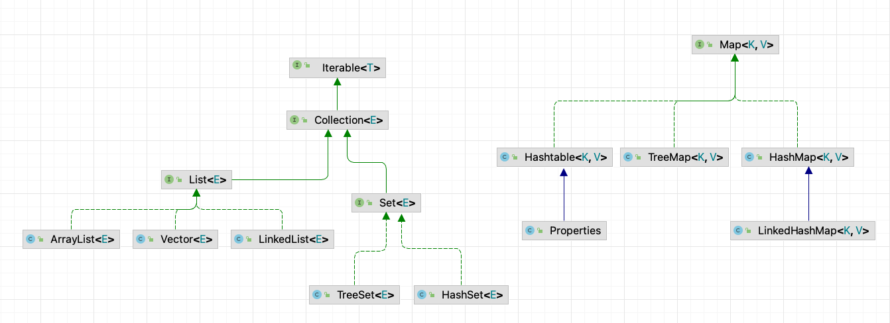

# 6_集合类

- [6_集合类](#6_集合类)
  - [分析数组的不足](#分析数组的不足)
  - [集合的优势](#集合的优势)
  - [集合框架体系](#集合框架体系)
  - [Collection 接口和常用方法](#collection-接口和常用方法)
    - [Collection 常用方法](#collection-常用方法)
    - [Iterator 迭代器](#iterator-迭代器)
    - [增强for循环](#增强for循环)
  - [List接口](#list接口)
    - [ArrayList 注意事项](#arraylist-注意事项)
      - [ArrayList 源码解读](#arraylist-源码解读)
    - [Vector 类](#vector-类)
      - [Vector 源码解读](#vector-源码解读)
    - [ArrayList 和 Vector 比较](#arraylist-和-vector-比较)
    - [LinkedList 底层结构](#linkedlist-底层结构)
    - [ArrayList和LinkedList的比较](#arraylist和linkedlist的比较)
  - [Set接口](#set接口)
    - [HashSet类](#hashset类)

## 分析数组的不足

- 数组的不足
  - 长度开始时必须指定，而且一旦指定，不能更改
  - 保存的必须为同一类型的元素
  - 使用数组进行增加/删除元素比较麻烦

## 集合的优势

- 可以动态保存任意多个对象，使用比较方法；
- 提供了一系列方法的操作对象的方法：add、remove、set、get等；
- 使用集合添加、删除元素比较方便；

## 集合框架体系



1. 集合主要两组（单列集合，双列集合）；
2. `Collection` 接口有两个重要的子接口`List`、`Set`，他们的实现子类都是单例集合；
3. `Map` 接口的实现子类 是双列集合，存放的 K-V；

## Collection 接口和常用方法

`public interface Collection<E> extends Iterable<E>`

1. Collection 实现子类可以存放多个元素，美国元素可以是Object；
2. 有些Collection的实现类，可以存放重复的元素，有些不可以；
3. Collection接口没有直接的实现子类，是通过它的子接口Set和List来实现的

### Collection 常用方法

- add：添加单个元素
- remove：删除指定元素
- contains：查找元素是否存在
- size：获取元素个数
- isEmpty：判断是否为空
- clear：清空
- addAll：添加多个元素
- containsAll：查找多个元素是否都存在
- removeAll：删除多个元素

[演示代码：CollectionDemo01.java](./code2/src/main/java/org/gx/chapter14/p01/CollectionDemo01.java)

### Iterator 迭代器

- Iterator对象称为迭代器，主要用于遍历Collection集合中的元素；
- 所有实现了Collection接口的集合类都有一个iterator()方法，用以返回一个实现了Iterator接口的对象，即可以返回一个迭代器。
- Iterator仅用于遍历集合，Iterator本身并不存放对象。

[演示代码：IteratorDemo01.java](./code2/src/main/java/org/gx/chapter14/p01/IteratorDemo01.java)

### 增强for循环

``` java
List l = new ArrayList();
l.add(1);
l.add(2);
l.add(3);

for(Integer i : l){
  System.out.println(i);
}
```

## List接口

List接口是Collection接口的子接口；

1. List集合类中元素有序（即添加顺序和取出顺序一致）、且可重复；
2. List集合中的每个元素都有其对应的顺序索引，即支持索引；
3. List容器中的元素都对应一个整数型的序号记载其在容器中的位置，可以根据序号存取容器中的元素；
4. List的实现类有：ArrayList、LinkedList 和 Vector；

- List接口的常用方法：

  ``` java
  List<String> l1 = new ArrayList<>();
  // 默认在结尾处添加
  l1.add("A");
  l1.add("C");

  // 在指定位置添加；从index=1的位置插入一个对象
  l1.add(1, "B");
  System.out.println(l1);

  // 在指定位置添加多个
  List<String> l2 = new ArrayList<>();
  l2.add("E");
  l2.add("F");
  l1.addAll(1,l2);
  System.out.println(l1);

  // 取出指定index位置的元素
  System.out.println(l1.get(1));

  // 查找obj在集合中首次出现的位置
  System.out.println(l1.indexOf("B"));
  // 查找obj在集合中末次出现的位置
  System.out.println(l1.lastIndexOf("E"));

  // 删除指定index位置的元素
  l1.remove(0);
  System.out.println(l1);

  // 替换指定index位置的元素
  l1.set(0,"G");
  System.out.println(l1);

  // 返回从fromIndex到toIndex位置的子集合【前闭后开】
  System.out.println(l1.subList(1,3));
  ```

### ArrayList 注意事项

1. ArrayList 可以加入null，并且多个；
2. ArrayList 是由数组来实现数据存储的；
3. ArrayList 基本等同于Vector，除来 ArrayList 是线程不安全（执行效率高），在多线程情况下，不建议使用ArrayList。

#### ArrayList 源码解读

``` java
// 无参构造器
public ArrayList() {
    // 使用无参构造器创建的，elementData默认设置的空数组；
    this.elementData = DEFAULTCAPACITY_EMPTY_ELEMENTDATA;
}

// 扩容机制
private int newCapacity(int minCapacity) {
    // overflow-conscious code
    int oldCapacity = elementData.length;
    // 解读：扩容1.5倍；oldCapacity >> 1 = oldCapacity / 2
    int newCapacity = oldCapacity + (oldCapacity >> 1);
    if (newCapacity - minCapacity <= 0) {
        if (elementData == DEFAULTCAPACITY_EMPTY_ELEMENTDATA)
            // 解读：
            //   这里扩容的时候，判断elementData如果是空的，默认初始化15的容量空间
            return Math.max(DEFAULT_CAPACITY, minCapacity);
        if (minCapacity < 0) // overflow
            throw new OutOfMemoryError();
        return minCapacity;
    }
    return (newCapacity - MAX_ARRAY_SIZE <= 0)
        ? newCapacity
        : hugeCapacity(minCapacity);
}

```

### Vector 类

1. Vector底层也是一个对象数组，`protected Object[] elementData`;
2. Vector是线程同步到，即线程安全，Vector类的操作方法带有`synchronized`；
3. 在开发中，需要现场同步安全时，考虑使用 `Vector`；

#### Vector 源码解读

``` java

// 解读：无参构造器，默认指定10个容量空间
public Vector() {
    this(10);
}

// 扩容机制
private int newCapacity(int minCapacity) {
    // overflow-conscious code
    int oldCapacity = elementData.length;
    // 解读：默认是扩容一倍的容量；如果指定量capacityIncrement（容量增量），就按照capacityIncrement进行扩容
    int newCapacity = oldCapacity + ((capacityIncrement > 0) ?
                                        capacityIncrement : oldCapacity);
    if (newCapacity - minCapacity <= 0) {
        if (minCapacity < 0) // overflow
            throw new OutOfMemoryError();
        return minCapacity;
    }
    return (newCapacity - MAX_ARRAY_SIZE <= 0)
        ? newCapacity
        : hugeCapacity(minCapacity);
    }
```

### ArrayList 和 Vector 比较

|           | 底层结构 | （开始）版本 | 线程安全（同步）效率 | 扩容                                                                                                                   |
| --------- | -------- | ------------ | -------------------- | ---------------------------------------------------------------------------------------------------------------------- |
| ArrayList | 可变数组 | jdk1.2       | 不安全，效率高       | 如果有参构造1.5倍；如果无参：第一次10，从第二次开始按1.5扩                                                             |
| Vector    | 可变数组 | jdk1.0       | 安全，效率不高       | 如果是无参，默认10，满后，按照2倍扩；如果指定大小，则每次直接按2倍扩；如果指定大小，并且指定增加量，则按照增加量扩容； |

### LinkedList 底层结构

- 说明：
  - LinkedList底层实现了双向链表和双端队列特点；
  - 可以添加任意元素（元素可以重复），包括null；
  - 线程不安全，没有实现同步；

- 底层操作机制
  - LinkedList底层维护了一个双向链表。
  - LinkedList中维护了两个属性`first`和`last`分别指向：首节点和尾节点；
  - 每个节点（Node对象），里面又维护了prev、next、item三个属性，其中通过prev指向前一个，通过next指向后一个节点。最终实现双向链表；
  - 所以LinkedList的元素的添加和删除，不是通过数组完成的，相对来说效率较高。
  - 模拟一个简单的双向链表；[查看代码：MyLinkedList.java](./code2/src/main/java/org/gx/chapter14/p01/MyLinkedList.java) ;

### ArrayList和LinkedList的比较

|            | 底层结构 | 增删的效率         | 改查的效率 |
| ---------- | -------- | ------------------ | ---------- |
| ArrayList  | 可变数组 | 较低；数组扩容     | 较高       |
| LinkedList | 双向链表 | 较高；通过链表追加 | 较低       |

- 如何选择ArrayList和LinkedList
  - 如果我们改查的操作多，选择ArrayList;
  - 如果我们增删的操作多，选择LinkedList;
  - 一般来说，在程序中，80%~90%都是查询，因此大部分情况下会选择ArrayList;
  - 在一个项目中，根据业务灵活选择，也可以这样，一个模块使用的ArrayList，另一个模块是LinkedList;

## Set接口

- 基本介绍：
  1. 无序（添加和取出的顺序不一致），没有索引；
  2. 不允许重复元素，所以最多包含一个null；
  3. JDK API 中 Set 接口的实现类有：`HashSet`、`TreeSet`、`LinkedHashSet`；

- Set接口的常用方法：
  - 和List接口一样，Set接口也是Collection的子接口，因此，常用方法和Collection接口一样。

- Set接口的遍历方式：
  - 可以使用迭代器；
  - 增强for；
  - <font color="red">不能使用</font>索引的方式来获取；

### HashSet类

- HashSet实现了Set接口；
- HashSet实际上是HashMap，看源码。
  
  ``` java
  public HashSet() {
      map = new HashMap<>();
  }
  ```

- 可以存放null值，但是只能有一个null
- HashSet不保证元素是有序的，取决于Hash后，再确定索引的结果。
- 不能有重复元素；