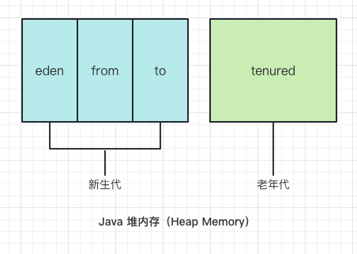

# 6. 初始化和清理

- [6. 初始化和清理](#6-初始化和清理)
  - [6.1. 用构造器保证初始化](#61-用构造器保证初始化)
  - [6.2. 方法的重载](#62-方法的重载)
    - [6.2.1. 区分重载的方法](#621-区分重载的方法)
    - [6.2.2. 使用基本类型的重载](#622-使用基本类型的重载)
    - [6.2.3. 通过返回值区分重载方法](#623-通过返回值区分重载方法)
  - [6.3. 无参构造器](#63-无参构造器)
  - [6.4. this关键字](#64-this关键字)
    - [6.4.1. 在构造器中调用构造器](#641-在构造器中调用构造器)
    - [6.4.2. static的含义](#642-static的含义)
  - [6.5. 清理：终结和垃圾收集](#65-清理终结和垃圾收集)
    - [6.5.1. finalize() 的作用](#651-finalize-的作用)
    - [6.5.2. 你必须执行清理](#652-你必须执行清理)
    - [6.5.3. 终止条件](#653-终止条件)
    - [6.5.4. 垃圾收集器的工作原理](#654-垃圾收集器的工作原理)
      - [6.5.4.1. 垃圾收集器：停止-复制算法](#6541-垃圾收集器停止-复制算法)
      - [6.5.4.2. 垃圾收集器：标记-清除算法](#6542-垃圾收集器标记-清除算法)
      - [6.5.4.3. 垃圾收集器：分代](#6543-垃圾收集器分代)
      - [6.5.4.4. 垃圾收集器：自适应](#6544-垃圾收集器自适应)
      - [6.5.5. 资源清理的总结:](#655-资源清理的总结)

## 6.1. 用构造器保证初始化

- 在 Java 中，类的设计者可以通过编写`构造器`来确保每个对象的初始化；
- `构造器`的名字就是`类`的名字；
- 不带参数的构造器叫作`默认构造器（default constructor）`，也叫作`无参构造器（no-arg constructor）`，Java文档已经开始使用术语`零参数构造器（zero-argument constructor）`。
- 构造器也可以传入参数来指定如果创建对象。
- 如果类`Tree` 有一个构造器，它接受一个表示高度的整数参数，如：`Tree(int)`是唯一的构造器，编译器就不会让任何其他方式创建 `Tree` 对象；
- 构造器是一类特殊的方法，它`没有返回类型`;

## 6.2. 方法的重载

- 通常来说，同一个词可以表达几种不同的含义，这就是`重载（overload）`；
- Java 中，必须要有方法名重载的另一个因素是构造器。因为构造器的名字是由类名预先确定的，所以只能有一个构造器名字。
- 如果允许具有不同参数类型的方法有相同的名字，那就必须要有`方法重载`；
- 方法重载对于构造器是必需的，但也可以用于其他任何方法；

### 6.2.1. 区分重载的方法

- 每个重载方法必须有独一无二的参数类型列表。

### 6.2.2. 使用基本类型的重载

- 基本类型可以从较小类型自动提升到较大类型。
  - [参考代码](../../hsp/1_java_basics/code2/src/main/java/org/gx/onjava/chapter06_housekeeping/PrimitiveOverloading.java)
- 如果传入数据的类型比方法参数的类型更宽，就必须使用窄化转型。
  - [参考代码](../../hsp/1_java_basics/code2/src/main/java/org/gx/onjava/chapter06_housekeeping/Demotion.java)

### 6.2.3. 通过返回值区分重载方法

> “为什么只通过参数列表来区分重载方法？为什么不根据方法的返回值来区分？”

比如下面定义的两个方法虽然具有相同的名字和参数，但很容易就能通过返回值区分开来：

``` java
void f() {}
void f() {return 1;} 
```

只有编译器能从上下文中明确地判断出语句的含义，这种方式才是可行的。比如在 `int x = f()`中，x 的类型能够高手编译器，我们想要调用哪个版本的 `f()`，但还可以调用 `f()` 并忽略它的返回值。 这被称为 **调用方法的副作用** ，此时我们不关心返回值，而只是想要方法调用的其他效果。因此这样调用方法 `f();` 此时 Java 如何确定应该调用哪个 `f()`？阅读代码的人又该如何理解它呢？由于存在这些问题，我们不能使用返回值类型来区分重载方法。

## 6.3. 无参构造器

- 无参构造器（又叫“默认构造器”或“零参数构造器”）是没有参数的构造器，用于创建“默认对象”。
- 如果创建了一个`没有构造器`的类，编译器会自动为这个类添加一个无参构造器。

## 6.4. this关键字

- this关键字：想在一个方法里获得对当前对象的引用；
- this关键字只能在非静态方法中使用。
- 当你想在方法里调用对象时，直接使用this就可以，因为它表示对该对象的引用。可以像使用任何其他对象引用一样使用this；
- 如果从类的一个方法中调用该类的另一个方法，那么就没必要使用this，直接调用即可。编译器会自动帮你添加。
- 应用场景：
  - 经常用在return语句中，来返回当前对象的引用；
  - this关键字还可以将当前对象传递给另一个方法；

### 6.4.1. 在构造器中调用构造器

- 当一个类里有多个构造器时，有时会希望从一个构造器里调用另一个构造器，以避免重复的代码。可以使用this关键字进行此类调用。

- 通常情况下，当提及this时，指的是“这个对象”或“当前对象”，并且this本身表示对当前对象的引用。在构造器中，如果在this后加了参数列表，那么就有了不同的含义，它会显示调用与该参数列表匹配的构造器。

- [参考代码: ~/housekeeping/Flower.java](../../hsp/1_java_basics/code2/src/main/java/org/gx/onjava/chapter06_housekeeping/Flower.java)

- this的另一种用法。参数和成员数据名字相同时，可以使用 `this.s`来表示成员数据；

### 6.4.2. static的含义

- 了解了this关键字后，就可以更全面地理解将一个方法设为static意味着什么：这种方法没有this。
- 不能从静态（static）方法内部调用非静态方法（反过来倒是可以的）；
- 可以在没有创建对象的时候，直接通过类本身调用一个静态方法。事实上这正是静态方法的主要用途。
- 一个类里的静态方法可以访问其他静态方法和静态字段；

## 6.5. 清理：终结和垃圾收集

### 6.5.1. finalize() 的作用

- finalize() 的使用仅限于一种特殊的情况：对象以某种特殊方式分配存储空间，而不是通过创建对象来分配；
- 假设你的对象在`不使用 new `的情况下分配了一块“特殊”内存。垃圾收集器只知道如果释放由 new 分配的内存，所以它不知道如何释放对象的这块“特殊”内存。
- `未使用 Java 的new分配内存`：
  - 采用了类似 C 语音的机制，在Java中，就是使用`本地方法`来实现（通过 native），例如通过调用 C 的 malloc() 系列函数来分配存储空间。此时，应该在 finalize() 方法中调用 C 的 free() 函数。

### 6.5.2. 你必须执行清理

- Java 语音规范不仅不保证finalize()方法会被及时执行，而且根本就不保证它们会被执行。

- 本书建议“永远不要直接调用 finalize() 方法”！
  - 为什么？ -- 假设用 finalize() 方法关闭已经打开的文件，由于 finalize() 方法有可能永远不执行，也可能被延迟执行，就可能导致该文件迟迟未能关闭，甚至永远没有关闭，最终导致大量的文件会保留在打开状态。积累到一定程度，程序就可能再也无法打开文件，导致运行失败！

### 6.5.3. 终止条件

- finalize()还有一个有趣的用法，它不依赖于每次都被调用。这就是对象`终止条件`的验证；
  - 例如：在 finalize() 方法中验证打开的文件是否在对象销毁之前就被关闭了，如果在执行 finalize() 时，文件的状态还是打开状态，可以抛出异常。

### 6.5.4. 垃圾收集器的工作原理

- 垃圾收集：
  - Java 虚拟机（JVM）垃圾收集器（Garbage Collector）提供的一种用于在`空闲时间` `不定时回收` `任何对象引用的对象占据的内存空间`的一种机制。

- 垃圾收集器的特征
  - 停止-复制（stop-and-copy）
  - 标记-清除（mark-and-sweep）
  - 分代（generation）
  - 自适应（adaption）

#### 6.5.4.1. 垃圾收集器：停止-复制算法

- 程序首先停止，然后将所有存活对象从一个堆复制到另一个堆，剩下的就都是垃圾。当一个对象从一个地方移动到另一个地方时，所有指向该对象的引用都必须修改。

- 该算法问题：
  - 你需要两个堆，然后在这两个独立的堆之间来回复制内存，这比实际需要多了一倍内存；
  - 一旦程序变得稳定，它可能很少产生垃圾，甚至没有。尽管如此，复制收集器仍会将所有内存从一个地方复制到另一个地方；

#### 6.5.4.2. 垃圾收集器：标记-清除算法

- 该算法从栈和静态存储开始，遍历所有引用以查找存活对象。每当它找到一个存活对象，就会给该对象设置一个标志。此时尚未开始收集，只有在标记过程完成后才会进行清除。在清除过程中，没有标记的对象被释放，但不会发生复制。

- 该算法的特征：
  - 对于一般用途，“标记 - 清除”算法相当慢；在垃圾很少或没有的时候，它的速度就很快了。

#### 6.5.4.3. 垃圾收集器：分代



- 创建一个对象的时候，总是在`Eden区`操作，当这个区满了，那么就会触发一次`Young GC`，也就是年轻代的垃圾回收；
- 当`Eden区`再次被用完，就再触发一次`Young GC`，此时会将`Eden区`和`From区`还在被使用的对象复制到`To区`；
- 在下一次`Young GC`到时候，则是将`Eden区`和`To区`还在被使用的对象复制到`From区`；
- 若干次`Young GC`后，有些对象在`From区`和`To区`之间来回游荡，一旦超出阀值，就将他们复制到`老年代`。如果`老年代`被用完，则执行`Full GC`；

#### 6.5.4.4. 垃圾收集器：自适应

- JVM会监控垃圾收集器的效率，如果所有对象都很稳定，垃圾收集器效率很低的话，它会切换到“标记-清除”算法。同样，JVM会跟踪标记和清除的效果，如果堆里开始出现很低碎片，它会切换回“停止-复制”算法。

#### 6.5.5. 资源清理的总结:

- 在Java中始终使用new创建对象，此时，垃圾收集器会自动释放存储空间；
- 如果在 Java 中通过其他机制创建了本地对象，则使用 finalize() 管理内存的释放，并通过垃圾收集器自动调用；
- 如果需要终止对象封装的资源（如：文件或线程），请提供一个显示的终止方法，如显示定义 close() 方法；