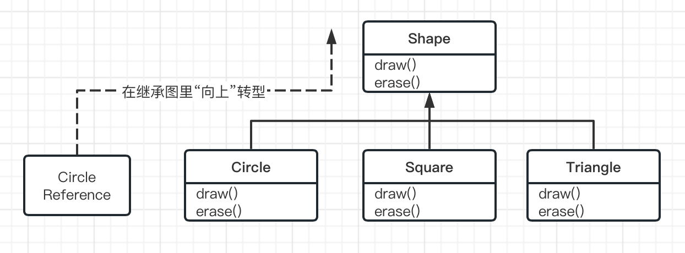
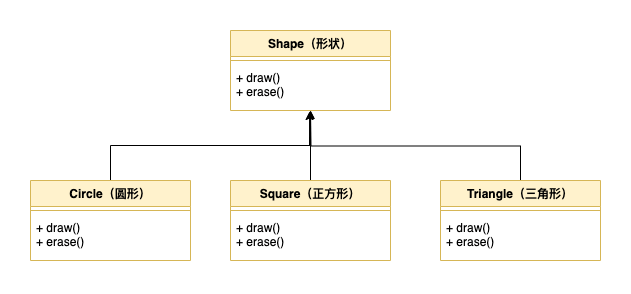
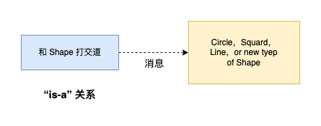
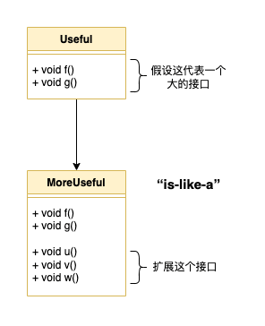
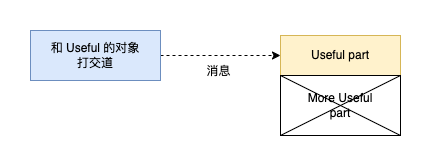

# 9. 多态

- [9. 多态](#9-多态)
  - [9.0. 引言](#90-引言)
  - [9.1. 再论向上转型](#91-再论向上转型)
  - [9.2. 难点](#92-难点)
    - [9.2.1. 方法调用绑定](#921-方法调用绑定)
    - [9.2.2. 产生正确的行为](#922-产生正确的行为)
    - [9.2.3. 可扩展性](#923-可扩展性)
    - [9.2.4. 陷阱：“重写” private方法](#924-陷阱重写-private方法)
    - [9.2.5. 陷阱：字段与静态方法](#925-陷阱字段与静态方法)
      - [9.2.5.1. 陷阱：字段](#9251-陷阱字段)
      - [9.2.5.2. 陷阱：静态方法](#9252-陷阱静态方法)
  - [9.3. 构造器多态](#93-构造器多态)
    - [9.3.1. 构造器的调用顺序](#931-构造器的调用顺序)
    - [9.3.2. 继承与清理](#932-继承与清理)
    - [9.3.3. 构造器内部的多态方法行为](#933-构造器内部的多态方法行为)
  - [9.4. 协变返回类型](#94-协变返回类型)
  - [9.5. 用继承进行设计](#95-用继承进行设计)
    - [9.5.1. 替换与扩展](#951-替换与扩展)
    - [9.5.2. 向下转型](#952-向下转型)
  - [9.6. 总结](#96-总结)

## 9.0. 引言

- 面向对象编程语言的三个基本特性：`数据抽象`、`继承` 和 `多态`；
  
- 多态提供了另一个维度的接口与实现分离，将`做什么`与`怎么做`解耦。

- 多态改善了代码的组织结构和可读性，并且还能创建`可扩展`的程序，这些程序无论是在项目的开始阶段，还是在需要添加新功能时，都能持续演化及成长。

- 多态方法调用允许一种类型表现出与另一种相似类型之间的区别，只要它们都继承自相同的基类型即可。

- 通过基类来调用不同子类的相同方法，从而实现行为上的区别，这样就表现出了多态方法调用的差异性。

## 9.1. 再论向上转型

- 获取对象引用并将其当作基类类型的引用称为`向上转型`;

- 从`子类`向上转型到`基类`可以“缩小”该接口，但不会小于`基类`的完整接口；

- 忘记对象类型
  - 编写一个以基类为参数的方法，而不用担心任何特定的子类，这样不是更好吗？也就是说，忘记子类的存在，只编写与基类打交道的代码，这样不是很好吗？

## 9.2. 难点

### 9.2.1. 方法调用绑定

- 将一个方法调用和一个方法体关联起来的动作称为`绑定`;
- 在程序运行之前执行绑定（如果存在编译器和链接器的话，由它们来实现），称为 `前期绑定` ；
- `后期绑定`，绑定发生在<u>运行时</u>，并基于对象的类型。后期绑定也称为`动态绑定`或运行时绑定；
- Java中的所有方法绑定都是后期绑定，除非方法是`static`或`final`的（`private`方法隐式`final`）。这意味着通常不需要你决定是否要执行后期绑定，它会自动发生。

### 9.2.2. 产生正确的行为

- 一旦知道了Java中的所有方法绑定都是`后期绑定`，并以多态方式发生，你就可以编写只与基类打交道的代码了，并且知道所有的子类都可以使用这个相同的代码来正确工作。或者说，你 “向一个对象发送了一条消息，该消息自行判断应该去做什么事情。”；

- 经典的面向对象示例使用的是“形状”。有一个名为`Shape（形状）`的基类和各种子类：`Circle（圆形）、Square（正方形）、Triangle（三角形）`等。这个例子之所以如此有效是因为，“圆是一种形状”这个例子浅显易懂。



### 9.2.3. 可扩展性

- 再回到乐器的示例上。由于多态机制，可以向系统中添加任意数量的新类型，而无须更改 tune() 方法。在一个设计良好的 OOP 程序中，你的许多方法将遵循 tune() 的模型，即只与基类接口通信。这样的程序是可以扩展的，因为你可以通过继承公共基类来得到新的数据类型，从而添加新功能。操作基类接口的方法不需要做任何更改来适应新类。


### 9.2.4. 陷阱：“重写” private方法

``` java
public class PrivateOverride {
    private  void f(){
        System.out.println("private f()");
    }

    public static void main(String[] args) {
        PrivateOverride po = new Derived();
        po.f();
    }
}

class Derived extends PrivateOverride{
    public void f(){
        System.out.println("public f()");
    }
}

/* output
private f()
 */
```

- 观察上面的案例，得出结果是，只有非 `private` 的方法可以被重写，但要注意重写 `private` 方法的假象，它不会产生编译器警告，但也不会执行你可能期望的操作；

- 使用 `@Override` 注解，可以检测出 `private` 的方法被重写情况；

### 9.2.5. 陷阱：字段与静态方法

- *<u>一旦你了解了多态，你可能会开始认为一起都可能多态地发生。但是，只有普通的方法调用可以时多态的。</u>*

#### 9.2.5.1. 陷阱：字段

``` java
// 字段的直接访问时在编译时确定的

class Super {
    public int field = 0;

    public int getField() {
        return field;
    }
}

class Sub extends Super {
    public int field = 1;

    @Override
    public int getField() {
        return field;
    }

    public int getSupperField() {
        return super.field;
    }
}

public class FieldAccess {
    public static void main(String[] args) {
        Super sup = new Sub();
        System.out.println("sup.field = " + sup.field +
                ", sup.getField() = " + sup.getField());

        Sub sub = new Sub();
        System.out.println("sub.field = " + sub.field +
                ", sub.getField() = " + sub.getField() +
                ", sub.getSuperField() = " + sub.getSupperField());
    }
}

/* OUTPUT
sup.field = 0, sup.getField() = 1
sub.field = 1, sub.getField() = 1, sub.getSuperField() = 0
 */
```

- 任何字段访问都会被编译器解析，因此不是多态的。

- 尽管看起来可能是一个令人困惑的问题，但在实践中很少遇到这种情况。
  - 一方面，我们通常会将所有字段设为 `private` ，因此不会直接访问它们，而只会作为调用方法的副作用；
  - 另一方面，我们一般不会为基类字段和子类字段指定相同的名称，因为这样会造成混淆；

#### 9.2.5.2. 陷阱：静态方法

``` java
// 静态方法不是多态的
class StaticSuper {
    public static String staticGet() {
        return "Base staticGet";
    }

    public String dynamicGet() {
        return "Base dynamicGet";
    }
}

class StaticSub extends StaticSuper{
    public static String staticGet() {
        return "Derived staticGet";
    }

    @Override
    public String dynamicGet() {
        return "Derived dynamicGet";
    }
}

public class StaticPolymorphism {
    public static void main(String[] args) {
        StaticSuper sup = new StaticSub(); // 向上转型
        System.out.println(StaticSuper.staticGet());
        System.out.println(sup.dynamicGet());
    }
}

/* OUTPUT
Base staticGet
Derived dynamicGet
 */
```

- 如果一个方法是静态的，那它的行为就不会是多态的；
- 静态方法与类相关联，而不是与单个对象相关联；

## 9.3. 构造器多态

- 通常来说，构造器不同于其他类型的方法，当涉及多态时也是如此。

### 9.3.1. 构造器的调用顺序

- *<u>基类的构造器总是在子类的构造过程中被调用</u>*；
- 初始化会在继承层次结构里自动向上移动，因此每个基类的构造器都会被调用；
- 必须调用所有构造器；否则，将无法正确构造整个对象。这就是编译器会对子类的每个构造器部分强制执行基类构造器调用的原因。
- 如果没有在子类构造器中显示调用基类构造器，它将隐式调用基类的无参构造器。如果没有无参构造器，编译器会报错。

``` java
// 构造器调用顺序

class Meal { // 一餐
    Meal() {
        System.out.println("Meal()");
    }
}

class Bread {
    Bread() {
        System.out.println("Bread()");
    }
}

class Cheese { // 芝士
    Cheese() {
        System.out.println("Cheese()");
    }
}

class Lettuce { // 生菜
    Lettuce() {
        System.out.println("Lettuce()");
    }
}

class Lunch extends Meal { // 午餐
    Lunch() {
        System.out.println("Lunch()");
    }
}

class PortableLunch extends Lunch { // 便携式午餐
    PortableLunch() {
        System.out.println("PortableLunch()");
    }
}

public class Sandwich extends PortableLunch { // 三明治
    private Bread b = new Bread();
    private Cheese c = new Cheese();
    private Lettuce l = new Lettuce();

    public Sandwich() {
        System.out.println("Sandwich()");
    }

    public static void main(String[] args) {
        new Sandwich();
    }
}
/*
Meal()
Lunch()
PortableLunch()
Bread()
Cheese()
Lettuce()
Sandwich()
 */
```

- <u> `Sandwich` 对象创建时的输出显示，一个复杂对象的构造器调用顺序如下。
  1. 基类的构造器被调用，递归地重复此步骤，一直到构造层次结构的根。根类先被构造，然后是下一个子类，以此类推，直到最底层的子类；
  2. 然后按声明的顺序来初始化成员；
  3. 最后执行子类构造器的方法体；</u>

- 继承时，已经知道了基类的所有信息，并且可以访问基类的任何 `public` 和 `protected` 成员。这意味着在子类中，可以假设基类的所有成员都是有效的。

- 在构造器中，必须确定所有成员都已构建。保证这一点的唯一方法是首先调用基类的构造器。这样，当在子类构造器中时，基类中可以访问的所有成员就都已初始化了。

### 9.3.2. 继承与清理

- 当使用组合和继承来创建一个新类时，大多数时候不用担心清理。子对象通常可以留给垃圾收集器来处理。

- 清理的顺序应该与初始化顺序相反，以防止依赖于其他对象。对于字段，这意味着与声明顺序相反（因为字段是按声明顺序初始化的）。对于基类，首先执行子类清理，然后是基类清理。

- 虽然通常不必知晓清理工作，但当选择执行该操时，就必须小心谨慎；

### 9.3.3. 构造器内部的多态方法行为

- 在普通方法内部，动态绑定调用是在运行时解析的，这是因为对象不知道它时属于该方法所在的类还是其子类。
- 如果在构造器内调用动态绑定方法，就会用到该方法被重写后的定义。但是，这个调用的效果可能相当出乎意料，因为这个被重写的方法是在对象完全构造之前被调用的。这可能会带来一些难以发现的错误；

``` java
// 构造器和多态
// 不会生成你所期望的结果

class Glyph { // 石雕
    void draw() {
        System.out.println("Glyph.draw()");
    }

    Glyph() {
        System.out.println("Glyph() before draw()");
        draw();
        System.out.println("Glyph() after draw()");
    }
}

class RoundGlyph extends Glyph { //圆形石雕
    private int radius = 1; // 半径

    RoundGlyph(int r) {
        radius = r;
        System.out.println("RoundGlyph.RoundGlyph(), radius = " + radius);
    }

    @Override
    void draw() {
        System.out.println("RoundGlyph.draw(), radius = " + radius);
    }
}

public class PolyConstructors {
    public static void main(String[] args) {
        new RoundGlyph(5);
    }
}
/* OUTPUT
Glyph() before draw()
RoundGlyph.draw(), radius = 0
Glyph() after draw()
RoundGlyph.RoundGlyph(), radius = 5
 */
```

- 分析上面的案例，`Glyph.draw()` 是为重写而设计的，这个重写发生在 `RoundGlyph` 中。但是 `Glyph` 构造器调用了这个方法，而这个调用实际上是对 `RoundGlyph.draw()` 的调用，这似乎是我们的目的。输出显示，当Glyph的构造器调用 `draw()` 时，`radius` 的值甚至不是 *<u>默认值的初始值 `1` ，而是 `0` </u>*；

- <u> 前面所描述的初始化顺序还不是很完整，而这正是解开这一谜团的关键。实际的初始化过程如下所示。
  1. 在发生任何其他事情之前，为为对象分配的存储空间会被初始化为二进制零。
  2. 如前面所述的那样调用基类的构造器。此时被重写的 `draw()` 方法会被调用（是的，这发生在 RoundGlyph 构造器被调用**之前**），由于第1步的缘故，此时会发现 `radius` 值为零。
  3. 按声明的顺序来初始化成员；
  4. 子类构造器的主体代码被执行；</u>

> 编写构造器时有一个很好的准则：“用尽可能少的操作使对象进入正常状态，如果可以避免的话，请不要调用此类中的任何其他方法”；只有基类中的 `final` 方法可以在构造器中安全调用（这也使用于 `private` 方法，它们默认就是 `final` 的）。这些方法不能被重写，因此不会产生这种令人惊讶的问题。

## 9.4. 协变返回类型

- Java 5 添加了 `协变返回类型（covariant return type）`，这表示子类中重写方法的返回值可以是基类方法返回值的`子类型`；

``` java
// 协变返回类型

class Grain { // 粮食
    @Override
    public String toString() { return "Grain"; }
}

class Wheat extends Grain { // 小麦
    @Override
    public String toString() { return "Wheat"; }
}

class Mill { // 磨坊
    Grain process() { // 过程
        return new Grain();
    }
}

class WheatMill extends Mill { // 小麦磨坊
    @Override
    Wheat process() {
        return new Wheat();
    }
}

public class CovariantReturn {
    public static void main(String[] args) {
        Mill m = new Mill();
        Grain g = m.process();
        System.out.println(g);
        m = new WheatMill();
        g = m.process();
        System.out.println(g);
    }
}
/* OUTPUT
Grain
Wheat
 */
```

## 9.5. 用继承进行设计

- 如果在使用现有类创建新类时首先选择继承，事情可能会变得不必要地复杂；更好的方法时先选择组合，尤其是在不清楚到底使用哪种方法时。组合不会强制我们的程序设计使用继承层次结构。组合也更加灵活，因为在使用组合时可以动态选择类型（以及随之而来的行为），而继承则要求在编译时就知道确切的类型。

``` java
// 通过组合动态的改变对象的行为（状态设计模式）

class Actor { // 演员
    public void act() {
    }
}

class HappyActor extends Actor { // 喜剧演员
    @Override
    public void act() {
        System.out.println("HappyActor");
    }
}

class SadActor extends Actor { // 悲剧演员

    @Override
    public void act() {
        System.out.println("SadActor");
    }
}

class Stage { // 步骤 / 状态
    private Actor actor = new HappyActor();

    public void change() {
        actor = new SadActor();
    }

    public void performPlay() { // 开始表演
        actor.act();
    }
}

public class Transmogrify {
    public static void main(String[] args) {
        Stage stage = new Stage();
        stage.performPlay();
        stage.change();
        stage.performPlay();
    }
}
/* OUTPUT:
HappyActor
SadActor
 */
```

- `Stage`对象包含了一个 `Actor` 的引用，它被初始化为一个 `HappyActor` 对象。这意味着 `performPlay()` 方法会产生特定的行为。因为引用可以在运行时重新绑定到不同的对象，所以可以将 `actor` 中的引用替换为对 `SadActor` 对象的引用，这样 `performPlay()` 产生的行为也随之改变。因此就在运行时获得了动态灵活性（这也称之为 `状态模式` ）。

> 一条通用的准则是，“使用继承来表达行为上的差异，使用字段来表达状态上的变化”。在前面的例子中，两者都用到了：通过继承得到了两个不同的类来表达 act() 方法的差异，而 Stage 使用组合来允许其状态发生改变。在这里，状态的改变恰好导致来行为的变化。

### 9.5.1. 替换与扩展

- 创建继承层次结构的最简洁方法似乎是采用“纯粹”的方式。也就是说，只有来自基类的方法会在子类中被重写，如下图：



- 这可以称为纯粹的 *<u>`"is-a"`</u>* 关系，因为类的接口确定了它是什么。继承保证了任何子类都具有基类的全部接口，绝对不会少。如果按照这个图来设计，子类的接口也 **`不会比基类的多`**。

- 这种 “纯替换” 意味着子类对象可以完美地替换基类，并且在使用它们时也不需要知道有关子类的任何额外信息。



- 也就是说，基类可以接收任何发送给子类的消息，因为两者具有完全相同的接口。你所要做的就是从子类向上转型，然后再也不需要知道正在处理的对象的确切类型。一切都是通过多态来完成的。

- 当这样考虑时，似乎纯粹的 *<u>`"is-a"`</u>* 关系是唯一明智的方式，其他任何设计都显示了思维上的混乱，而且从定义上来讲就是错误的。这其实也是一个陷阱。一旦开始以这种方式思考，你就会发现扩展接口（不幸的是，关键字 `extends` 似乎在鼓励这样做）是解决特定问题的完美方案。这可以称为 *<u>`"is-like-a"`</u>* 的关系，因为子类像（like）基类 —— 它具有与其相同的基本接口 —— 但它还具有通过额外方法实现的其他特性。



- 虽然这也是一种有用且明智的方法（取决于具体情况），但它有一个缺点。子类中接口的扩展部分在基类中是不可用的，因此一旦向上转型，就无法调用新方法了。



- 如果不向上转型，就不会有任何问题，但你经常会遇到必须重新确定对象确切类型的情况，以便可以访问该类型的扩展方法。

### 9.5.2. 向下转型

- 因为 `向上转型` (在继承层次结构中向上移动) 会丢失特定类型的信息，所以完美自然就可以通过 `向下转型（downcast）` 来重新获取类信息，即在继承层次结构中向下移动。

- 向上转型是总是安全的，因为基类不可能有比子类更多的接口。因此，通过基类接口发送的每条消息都能保证被子类接受。

- 然而对于向下转型来说，我们并不知道这些。要解决这个问题，必须有某种方法来保证向下转型是正确的，这样就不会意外地转换为错误的类型，然后给对象发生它无法接受的消息。那将是不安全的。

- 在 Java 中，**每个** 转型都会被检测！因此，即使看起来只是在执行一个普通的带括号的强制转型，但在运行会检查此强制转型，以确保它实际上是你期望的类型。如果不是，则会抛出一个 `ClassCastException` 错误。这种运行时检查类的行为是 `Java反射（reflection）`的一部分。

## 9.6. 总结

- 多态意味着“不同的形式”。在面向对象编程中，我们拥有来自基类的相同接口，以及使用该接口的不同形式：动态绑定方法的不同版本。
- 在本章中可以看到，如果使用数据抽象和继承，就不可能理解甚至创建多态的示例。多态是一种不能孤立看待的特性（如 switch 这样的语句则是可以的），而只能作为类的关系这个全景中的一部分，与其他特性协同工作。
- 为了在程序中有效地使用多态，以及面向对象的技术，你需要扩展自己的编程视野，让它不仅包括单个类的成员和消息，还有类之间的共性以及它们彼此之间的关系。虽然这需要付出巨大的努力，但这样做是非常值得的。它会带来更快的程序开发、更好的代码组织、可扩展的程序和更容易维护的代码。

- 重点：
  - [9.3.1. 构造器的调用顺序](#931-构造器的调用顺序)
  - [9.5. 用继承进行设计（状态设计模式）](#95-用继承进行设计)
  - [9.5.1. 替换与扩展](#951-替换与扩展)