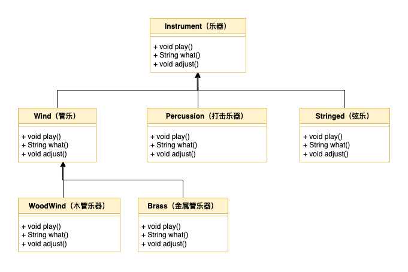

# 9. 多态

- [9. 多态](#9-多态)
  - [9.0. 引言](#90-引言)
  - [9.1. 再论向上转型](#91-再论向上转型)
  - [9.2. 难点](#92-难点)
    - [9.2.1. 方法调用绑定](#921-方法调用绑定)
    - [9.2.2. 产生正确的行为](#922-产生正确的行为)
    - [9.2.3. 可扩展性](#923-可扩展性)

## 9.0. 引言

- 面向对象编程语言的三个基本特性：`数据抽象`、`继承` 和 `多态`；
  
- 多态提供了另一个维度的接口与实现分离，将`做什么`与`怎么做`解耦。

- 多态改善了代码的组织结构和可读性，并且还能创建`可扩展`的程序，这些程序无论是在项目的开始阶段，还是在需要添加新功能时，都能持续演化及成长。

- 多态方法调用允许一种类型表现出与另一种相似类型之间的区别，只要它们都继承自相同的基类型即可。

- 通过基类来调用不同子类的相同方法，从而实现行为上的区别，这样就表现出了多态方法调用的差异性。

## 9.1. 再论向上转型

- 获取对象引用并将其当作基类类型的引用称为`向上转型`;

- 从`子类`向上转型到`基类`可以“缩小”该接口，但不会小于`基类`的完整接口；

- 忘记对象类型
  - 编写一个以基类为参数的方法，而不用担心任何特定的子类，这样不是更好吗？也就是说，忘记子类的存在，只编写与基类打交道的代码，这样不是很好吗？

## 9.2. 难点

### 9.2.1. 方法调用绑定

- 将一个方法调用和一个方法体关联起来的动作称为`绑定`;
- 在程序运行之前执行绑定（如果存在编译器和链接器的话，由它们来实现），称为 `前期绑定` ；
- `后期绑定`，绑定发生在<u>运行时</u>，并基于对象的类型。后期绑定也称为`动态绑定`或运行时绑定；
- Java中的所有方法绑定都是后期绑定，除非方法是`static`或`final`的（`private`方法隐式`final`）。这意味着通常不需要你决定是否要执行后期绑定，它会自动发生。

### 9.2.2. 产生正确的行为

- 一旦知道了Java中的所有方法绑定都是`后期绑定`，并以多态方式发生，你就可以编写只与基类打交道的代码了，并且知道所有的子类都可以使用这个相同的代码来正确工作。或者说，你 “向一个对象发送了一条消息，该消息自行判断应该去做什么事情。”；

- 经典的面向对象示例使用的是“形状”。有一个名为`Shape（形状）`的基类和各种子类：`Circle（圆形）、Square（正方形）、Triangle（三角形）`等。这个例子之所以如此有效是因为，“圆是一种形状”这个例子浅显易懂。

### 9.2.3. 可扩展性

- 再回到乐器的示例上。由于多态机制，可以向系统中添加任意数量的新类型，而无须更改 tune() 方法。在一个设计良好的 OOP 程序中，你的许多方法将遵循 tune() 的模型，即只与基类接口通信。这样的程序是可以扩展的，因为你可以通过继承公共基类来得到新的数据类型，从而添加新功能。操作基类接口的方法不需要做任何更改来适应新类。

