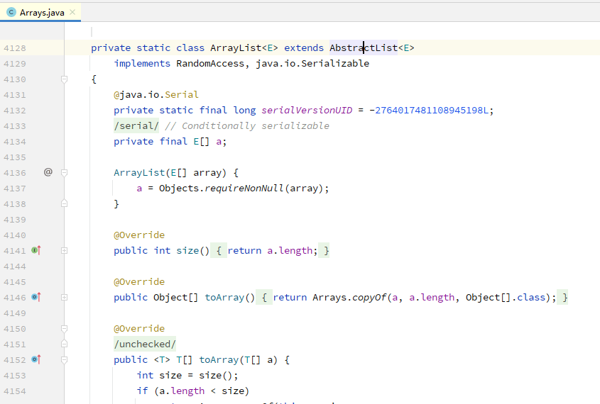

# 12. 集合

- [12. 集合](#12-集合)
  - [12.0. 引言](#120-引言)
  - [12.1. 泛型和类型安全的集合](#121-泛型和类型安全的集合)
    - [12.1.1. 新特性：类型推断和泛型](#1211-新特性类型推断和泛型)
  - [12.2. 基本概念](#122-基本概念)
  - [12.3. 添加一组元素](#123-添加一组元素)
  - [12.4. 打印集合](#124-打印集合)

## 12.0. 引言

- 数组是持有一组对象的最高效的方式，而且要持有一组基本类型数据的话，数组也是不二之选。但是，数组的大小是固定的。更常见的情况是，在编程的时候我们并不知道需要多少个对象，或者我们需要更高级的方式来保存对象，因此大小固定这一点就很有局限性了。

- `java.util` 库有相当完整的一组`集合类（collection class）`来解决这个问题，其中基本的类型是 `List`、`Set`、`Queue` 和 `Map` 。这些类型也叫作 `容器类（container class）`。集合类提供了一些持有对象的高级方法，并解决了相当多的问题。

- 不同的集合类有不同的特性，比如 `Set` 对于值相同的对象只会保存一个，而 `Map` 是一个关联数组，可以将对象和其他对象关联起来。*<u>除了这些独特之处，Java 集合类还有一大共性，那就是都可以自动调整大小。因此，和数组不同的是，我们可以再集合类中放入任意多个对象，而不用担心它应该是多大。</u>*

## 12.1. 泛型和类型安全的集合

- 使用 `Java 5` 之前的集合类，问题之一是编译器允许向集合中插入不正确的类型。
- 借助`泛型`，*<u>就可以再**编译时**防止将错误类型的对象加入某个集合中</u>*。

``` java
public static void main(String[] args) {
    ArrayList<Apple> apples = new ArrayList<>();
    for (int i = 0; i < 3; i++) {
        apples.add(new Apple());
    }
    // 编译时错误
    // apples.add(new Orange());
    for (Apple apple : apples){
        System.out.println(apple.id());
    }
}
```

- 定义在 `apples` 的表达式的右侧，出现了 `new ArrayList<>()` 。因为有钻石形状的 <> 符号，所以它有时也叫作 “钻石语法”。在 Java 7 之前，我们事实上必须在表达式的两侧重复写出类型声明，就像这样： `ArrayList<Apple> apples = new ArrayList<Apple>();` ;

- 当指定了某种类型作为泛型参数时，我们并不是只能放入该类型的对象。在泛型的情况下，向上转型也可以像其他类型中那样起作用；

### 12.1.1. 新特性：类型推断和泛型

- 第6章引入了 “`局部变量类型推断（var 的使用）`” 一节，这是 JDK 10/11 加入的特性。方便的是，这个特性也可以用来简化涉及泛型的定义。

``` java

// {NewFeature} 从 JDK 11 开始
public class GenericTypeInference {
    void old(){
        ArrayList<Apple> apples = new ArrayList<Apple>();
    }
    void modern(){
        var apples = new ArrayList<Apple>();
    }
    void pitFall (){ // 坑
        var apples = new ArrayList<>();
        apples.add(new Apple());
        apples.get(0); // 作为普通的 Object 类型返回
    }
}
```

- 注意， `modern()` 中定义右侧的钻石语法（`<>`）被显示的 `<Apple>` 替换掉了，这样编译器就有足够的信息来执行类型推断了。

- 替换现有代码中的钻石语法，在某些地方可能产生一个问题，就像在 `pitFall()` 中看到的那样。直接用 `pitFall()` 中的 `var` 替换 `old()` 中左侧的 `ArrayList<Apple>`，可以成功编译。`<>` 变成了 `<Object>` ，这不是我们想要的，但是编译器没有报错。

## 12.2. 基本概念

- Java 集合类库是用来“持有对象”的，而且从设计上讲，它可以分为两个不同的概念，表示为库的两个基本接口。
  1. **`Colletion`**: 一个由单独元素组成的序列，而且这些元素要符合一条或多条规则。 `List` 必须按照元素插入顺序来保存他们； `Set` 中不能存在重复元素；而 `Queue` 则要按照**排队规则**来输出元素（通常与元素插入的顺序相同）。
  2. **`Map`**: 一组键值对像对，使用键来查找值。`ArrayList` 使用一个数值来查找某个对象，所以在某种意义上它将数值与对象关联在了一起。而 `Map` 使用**另一个对象**来查找某个对象。它也被称作**关联数组**，因为它将对象与其他对象关联在了一起；或者被称作字典，这是因为它使用一个键对象来查找一个值对象，就像我们在字典中使用一个单词来查找其定义一样。 `Map` 是非常强大的编程工具；

``` java
List<Apple> apples = new ArrayList<>();

List<Apple> apples = new LinkedList<>();
```

- **序列**是持有一组对象的一种方式，而 `Collection` 接口就是序列概念的一般化；

- `add()` 方法是要将一个新元素放入 `Collection` 中；

- `Set` 的含义：只有元素不存在的时候才会将其放入。而对于 `ArrayList` , 或者是任何一种 `List` ， `add()` 的含义总是“放进去”，因为 `List` 不会关心元素是不是有重复；

## 12.3. 添加一组元素

- `java.util` 中的 `Arrays` 和 `Collections` 类都包含了一些工具方法，用于向一个 `Collection` 中添加一组元素；
  - `Arrays.asList()` 方法可以接受一个数组，或者一个用逗号分隔的元素列表（使用可变参数），并将其转换为一个 `List` 对象。
  - `Collections.addAll()` 方法接受一个 `Collection` 对象、一个数组，或者一个用逗号分隔的列表，将其中所欲的元素都添加到这个 `Collection` 中。

``` java
// 向 Collection 对象中添加一组元素
public class AddingGroups {
    public static void main(String[] args) {
        Collection<Integer> collection =
                new ArrayList<>(Arrays.asList(1, 2, 3, 4, 5));
        Integer[] moreInts = {6, 7, 8, 9, 10};
        collection.addAll(Arrays.asList(moreInts));
        // 运行快很多，但是我们无法以这种方式构建 Collection
        Collections.addAll(collection, 11,12,13,14,15);
        Collections.addAll(collection,moreInts);
        // 生成一个底层为数组的列表
        List<Integer> list = Arrays.asList(16,17,18,19,20);
        list.set(1,99); // 修改元素
        // list.add(21); // 运行时错误；底层的数组不能调整大学

    }
}
```

> 注意：`Arrays.asList()` 的输出，将其当做一个 `List`，但它的底层实现用的数组，大小无法调整。<u>底层使用了 `内部类` ，创建了一个私有的 `ArrayList`来实现 `List` ，参考下面的代码片段截图</u>：



## 12.4. 打印集合

- 我们必须使用 `Arrays.toString()` 来作为`数组`生成可以打印的表示，但是集合类不需要任何帮助，就能很漂亮地完成打印。

- `ArrayList` 和 `LinkedList` 都是 `List` 类型，都是以插入顺序保存元素的。两者的不同之处是对于特定类型的操作在性能上有差别，而且 `LinkedList` 包含的操作也多于 `ArrayList` ；

- `HashSet`、`TreeSet` 和 `LinkedHashSet` 都是 `Set` 类型。对于相同的条目 `Set` 只会保存一个，而且不同的 `Set` 实现会以不同方式保存元素。 `HashSet` 使用了一种相当复杂的方式存储元素，这种技术是检索元素最快的方式，因此存储顺序看起来没有实际意义（我们往往只关心某个元素是不是 `Set` 的成员，顺序并不重要）。如果存储顺序非常重要，可以使用 `TreeSet` ，它会升序保存对象；或使用 `LinkedHashSet` ，它会按照添加顺序来保存对象。

- `Map（也称作关联数组）`使用**键**来查找对象，就像一个简单的数据库。被关联的对象称作**值**。*相同的键， Map 只接受一个*。

- `Map.put(key, value)` 的作用是添加一个值（`value`，就是我们想要的），并将其与一个键（`key`，我们用它来查找）关联起来。 `Map.get(key)` 会得到与这个键（`key`）关联的值。

- `HashMap` 无序，使用了一种非常快速的算法，而该算法会控制顺序； `TreeMap` 会按照键的升序来排序； `LinkedHashMap` 则按照插入顺序来保存键，同时保留了 `HashMap` 的查找速度；